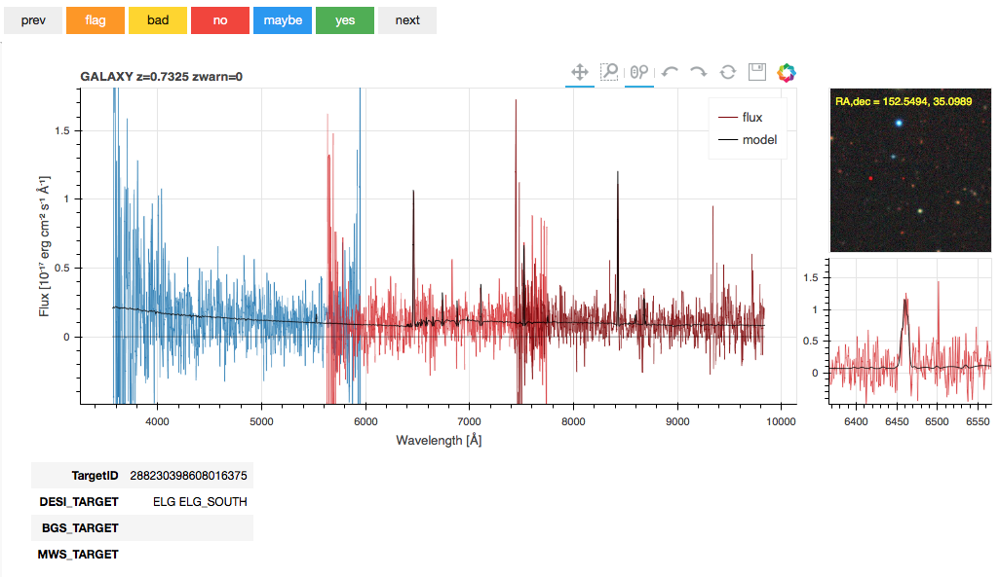

# Inspector

It's for inspecting DESI spectra.

## Overview

Inspector is a prototype DESI spectral viewer for use with jupyter
notebooks at NERSC.  It provides a fast interactive viewer for spectral
data at NERSC without requiring users to download the data
or install any code locally.

It is currently in a standalone package for exploratory development,
but could be moved into desispec after it matures.

This should be viewed as a technology demonstrator.  Details about the
interface and implementation can and probably will (should!) change.
The main point of releasing this package is to provide a functionally useful
demonstration that bokeh+jupyter+NERSC could work for viewing DESI spectra.

## Getting Started

See https://desi.lbl.gov/trac/wiki/Computing/JupyterAtNERSC for instructions to configure a desi-18.3 jupyter kernel at NERSC.  This only needs to be done once.

Checkout the Inspector code on cori.nersc.gov:
```
git clone https://github.com/sbailey/inspector
```

Login at https://jupyter-dev.nersc.gov and navigate to the directory
where you cloned the inspector repository.  Click `inspector.ipynb` to
start the notebook and explore.

Note: Unfortunately jupyter does not save the generated plots in
the notebook itself, so viewing the static notebook on github isn't
so instructive; you'll need to really start it at NERSC yourself.
There is a floppy disk (!) save icon on the plot that can be used to
save the plot if you want to send it to someone else.

## What it does

* Provides an interactive spectral viewer for DESI data at NERSC without
  needing to download or install anything locally.
* Interative zoom and pan
* Shows redrock results including the redshift, ZWARN flags, and the
  best fit model.
* Mouse over a region of the spectrum to get a real-time zoom in a sub-window;
  this is handy for inspecting narrow emission lines without zooming in and out
  on each one.
* Shows TARGETID and targeting bits from DESI_TARGET, MWS_TARGET,
  and BGS_TARGET.
* Imaging survey thumbnails and links.
* Highlight common emission / absorption lines.
* Buttons for navigating previous/next target
* Buttons for saving visual inspection results before moving to next target.



## What it doesn't do (yet)

Any of these could be added later but don't yet exist.
If you really want a feature, please consider contributing it.

* Show individual exposures (multiple exposures are coadded prior to display)
* Show errors and masks
* Show the Nth best fit instead of just the best fit
* Restframe wavelengths
* User-defined smoothing
* User-defined redshift
* More target info like mags and shapes
* Displaying model of 2D sky-subtracted raw data
* Viewing spectra that don't yet have redshift fits
* Filtering to individual exposures or tiles

<hr/>
**Stephen Bailey** Lawrence Berkeley National Lab<br/>
**Benjamin Weaver** National Optical Astronomy Observatory<br/>

Spring 2018
